# UJIAN AKHIR SEMESTER 1

# Nama          : Imam Solehudin
# NIM           : 312110290
# Kelas         : TI.21.C1
# Mata Kuliah   : Pemrograman

# Soal 

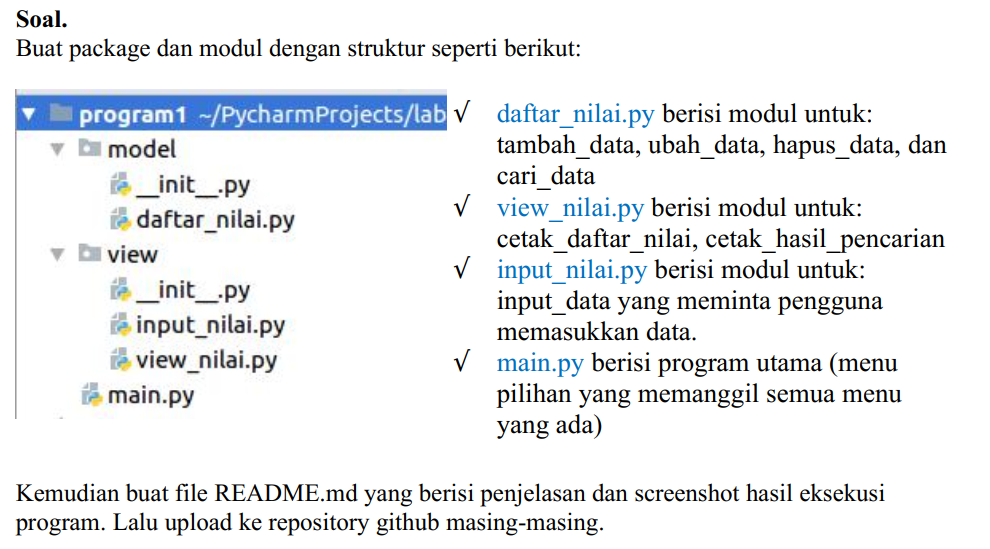

# Struktur Package dan Modul

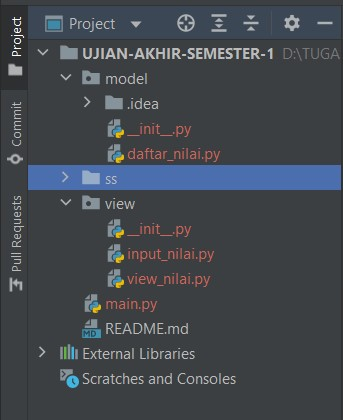

- Dalam folder model terdapat 1 file dengan nama daftar nilai dan dalam file tersebut ada suatu progrm yang berfungsi untuk menjalankan program tersebut.
Berikut program dari file daftar_nilai :

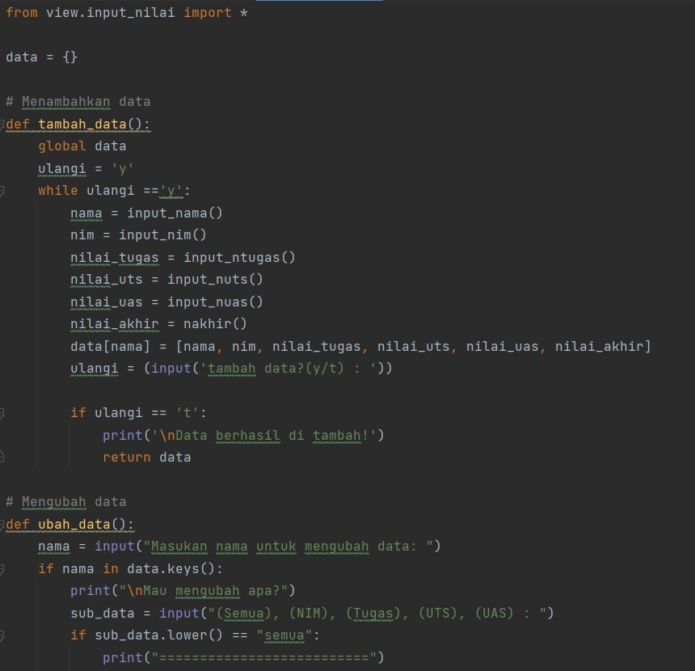
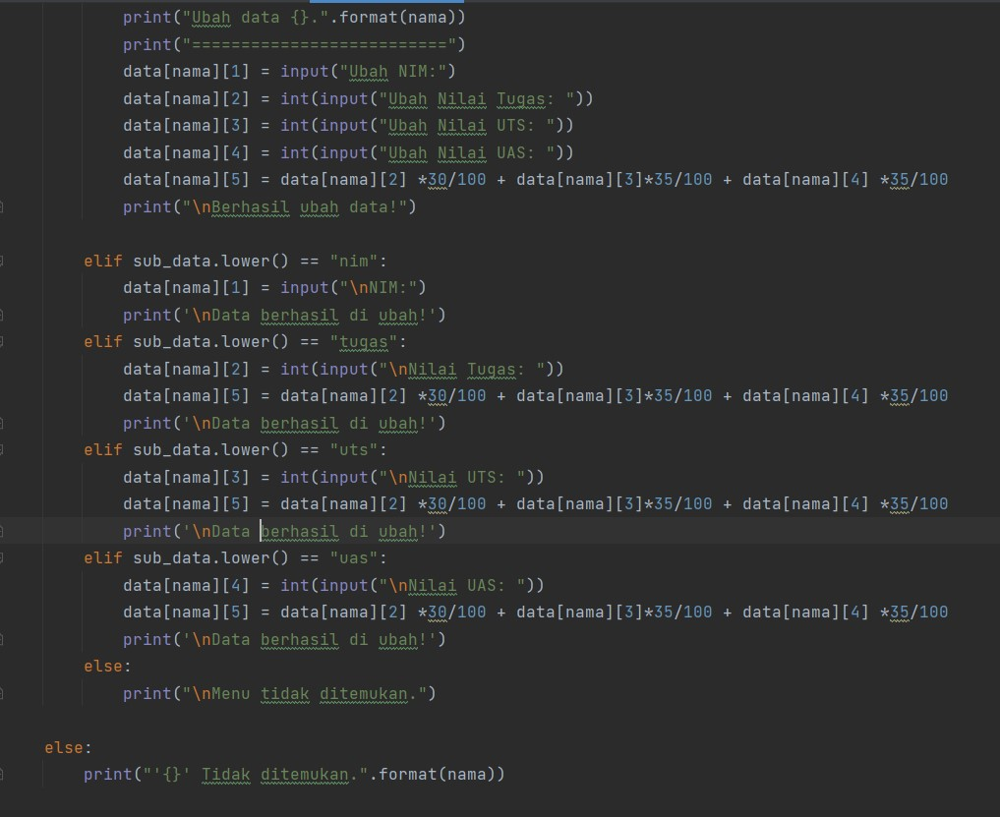
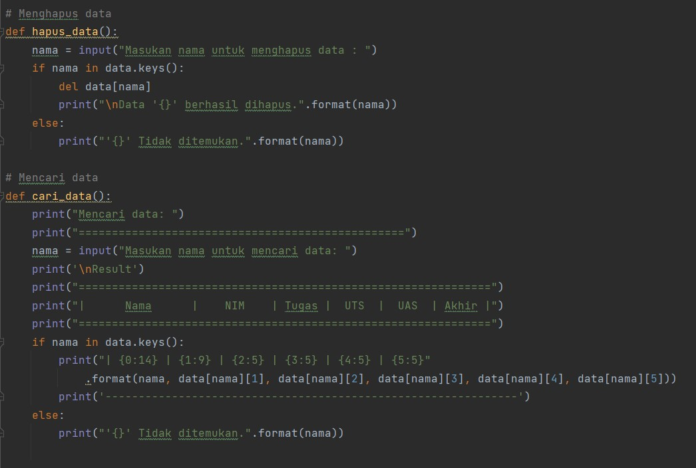

- Setelah membuat file daftar nilai saya juga buat folder view yang berisi file input_nilai dan view nilai, yang berfungsi untuk memasukan nilai dan melihat nilai yang telah dimasukan.
Berikut adlah programnya :

- Program input_nilai :

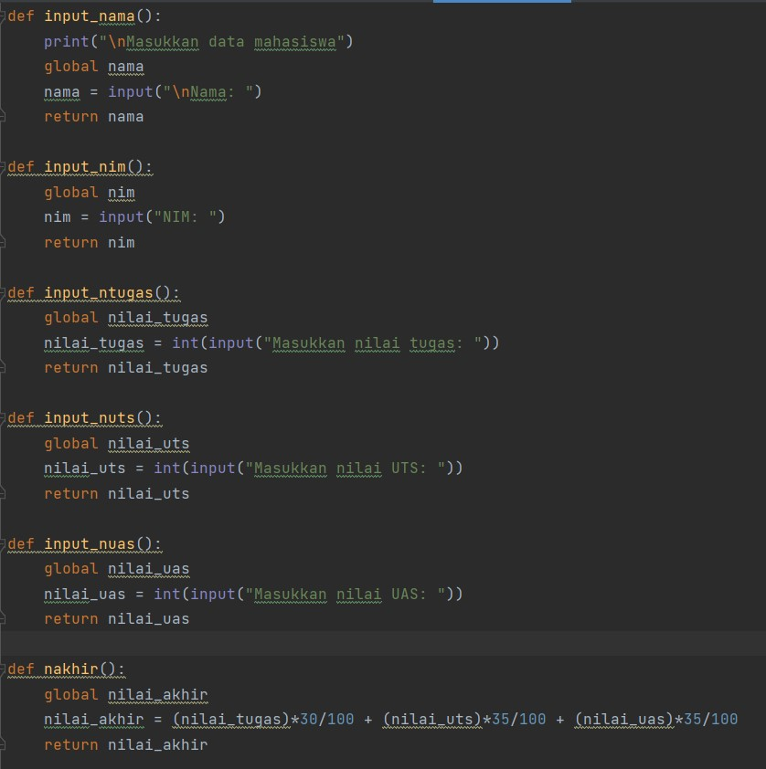

- Program view_nilai :

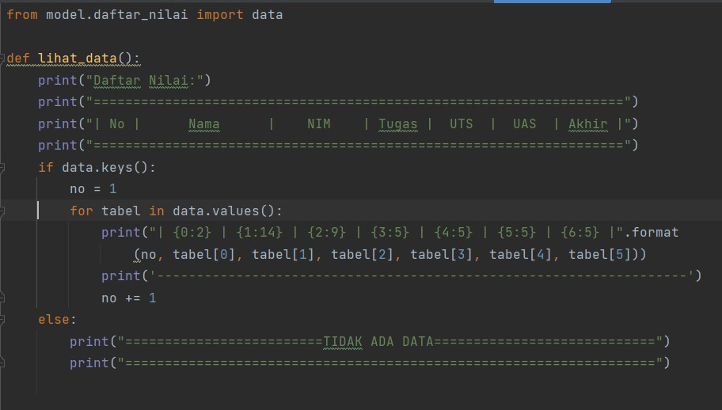

- Setelah membuat folder dan function, kita juga harus membuat file index utama, file tersebut berfungsi sebagai file utama yang kita jalankan dan untuk memanggil file function yang telah kita buat sebelumnya. 

Berikut programnya :

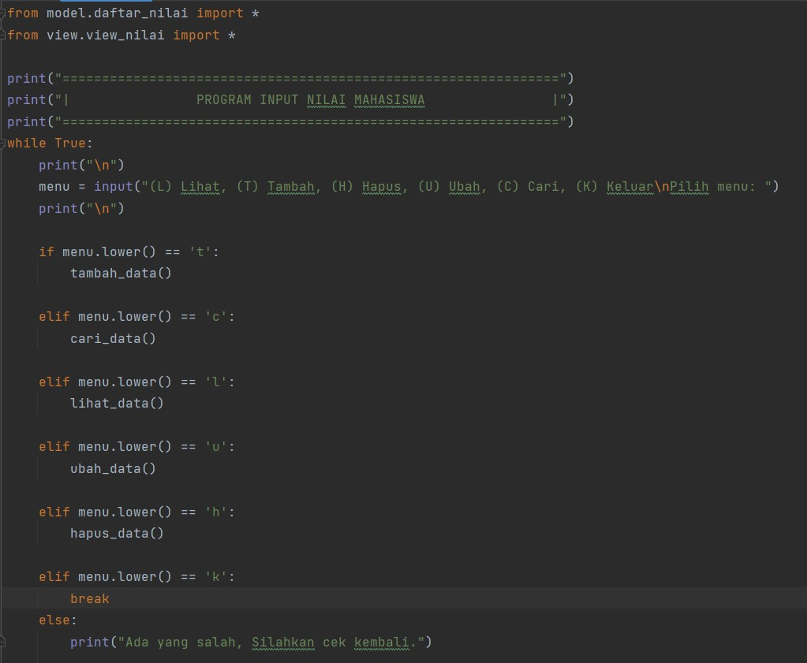

- Hasil dari program yang telah kita buat :

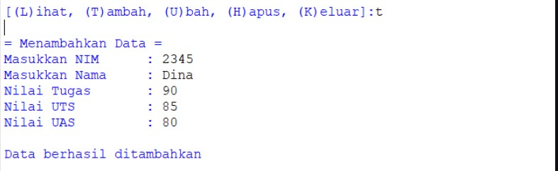

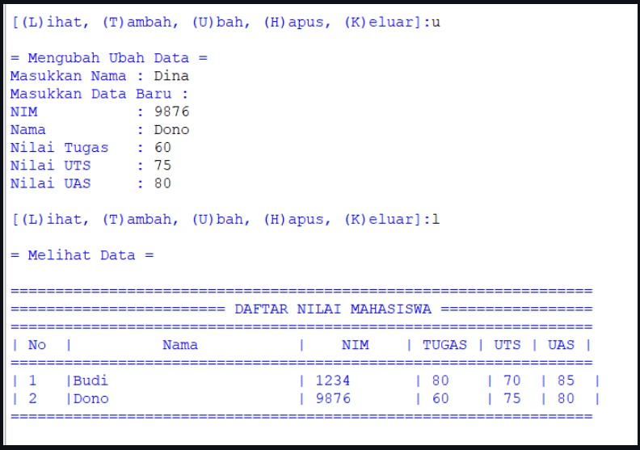

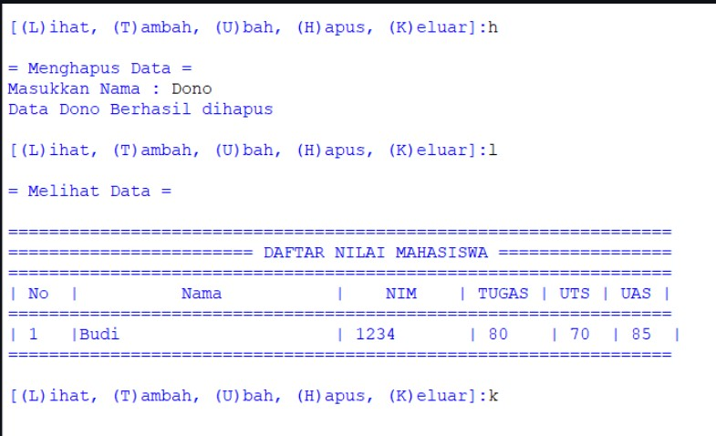
